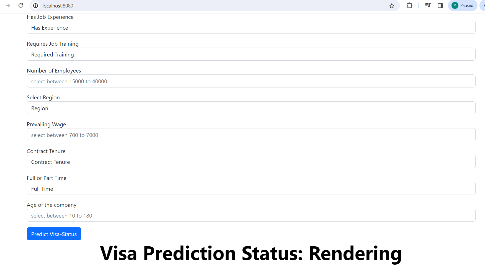

# US-Visa-Approval-Prediction
```Git commands
git add .

git commit -m "Updated"

git push origin main
```How to run?
conda create -n visa python=3.8 -y
conpida activate visa
pip install -r requirements.txt

``` 
WorkFlow

``` 
1. constant
2. config_entity
3. artifact_entity
4. conponent
5. pipeline
6. app.py / demo.py

``` Export Environment Variables ```


export MONGODB_URL="mongodb+srv://<username>:<password>...."

Screenshots for US visa application:



